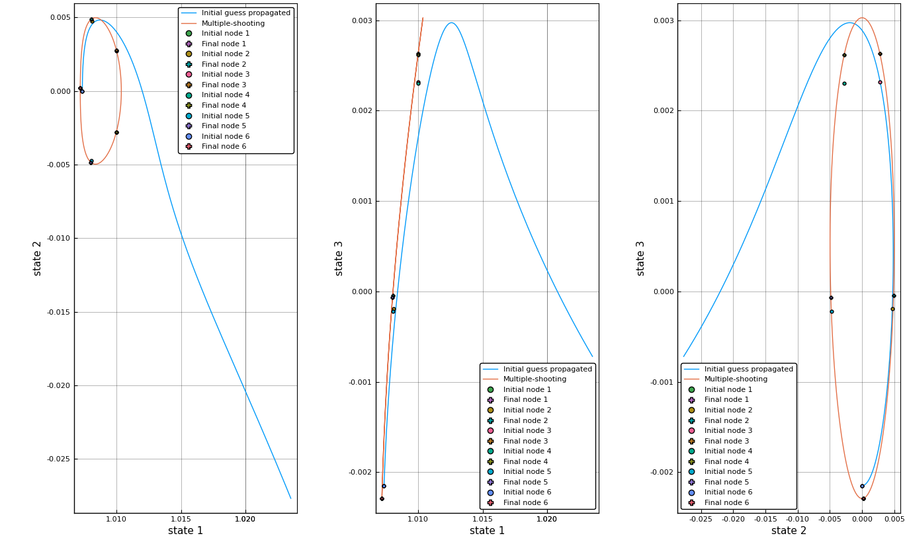

# Restricted Three Body Problem in Julia

Library implements methods for working with the restricted three body problem (R3BP).
User is expected to be familiar with `DifferentialEquations`, which `R3BP` utilizes for most primary functions.


### Dependencies
Dependencies used in this repo are: `DifferentialEquations`, `LinearAlgebra`, `Distributed`, `Roots`, `Printf`, `Plots`, `DataFrames`, `CSV`, `CSVFiles`, `Statistics`.

### Usage
#### CR3BP parameters and Lagrange points
```julia
include("R3BP.jl")
params = R3BP.get_cr3bp_param(399, 301)
mu = params.mu
println("mu: $mu")
lp = R3BP.lagrangePoints(mu)

```

returns the following:

```
5×3 Array{Float64,2}:
  0.836915   0.0       0.0  0.0  0.0  0.0
  1.15568    0.0       0.0  0.0  0.0  0.0
 -1.00506    0.0       0.0  0.0  0.0  0.0
  0.487849   0.866025  0.0  0.0  0.0  0.0
  0.487849  -0.866025  0.0  0.0  0.0  0.0
```

#### Integration of PCR3BP / CR3BP states
For integrating a trajectory, use the DifferentialEquations module together with R3BP:

```julia
using DifferentialEquations
using Plots

# define parameters
mu = 0.01215058426994;
X0 = [1.176924090973164 0.0 -0.060210863312217 0.0 -0.173836346247689 0.0];
T = 3.385326412831325;

tspan = (0.0, T)
p = (mu)
prob = ODEProblem(R3BP.rhs_cr3bp_sv!, X0, tspan, p)
sol = solve(prob, Tsit5(), reltol=1e-11, abstol=1e-11)

# plot using the sol object
plot(sol, vars=(1,2,3))
```

#### Manifold
A manifold of a LPO is usually propagated until a Poincare section, which is to be defined by a callback function:
```julia
function condition(u,t,integrator)
  u[1] - 1.25   # when y-value hits xx
end

affect!(integrator) = terminate!(integrator)

# assign callback
cb = ContinuousCallback(condition,affect!)
```
then define parameters for generating manifold
```julia
# parameters for manifolds
num_branch = 100;
stability = true;
ϵ = 1e-5  # or set to nothing to let the function scale based on LPO stability
tf = -5.0
```
and finally the function wraps DifferentialEquations' `EnsembleProblem()`

```julia
# generate manifolds
outsim = R3BP.get_manifold(mu, X0, T, tf, stability;
    n=num_branch, ϵ=ϵ, callback=nothing, xdir="positive");

# plot manifolds
plot(outsim, linealpha=0.4, vars=(1,2), flip=false, aspect_ratio=:equal)
```

#### Multiple shooting

First, construct a list of `n` nodes stored in `x0s` and `n-1` time-of-flights stored in `tofs`; then, call

```julia
prob_stm = ODEProblem(R3BP.rhs_cr3bp_svstm!, vcat(guess0.x0, reshape(I(6), (36,)))[:], guess0.period, (mu));
    
x0_conv, tof_conv, convflag = R3BP.multiple_shooting(prob_stm, x0s, tofs, 1.0e-12;
    periodic=true, fix_time=false, rhs=R3BP.rhs_cr3bp_svstm!, p=(mu))
```
    
A periodic orbit may be constructed using the multiple-shooting algorithm via 
<p align="center">
  
</p>

### Dev-notes
- [x] Stability for LPO
- [x] ER3BP propagator
- [x] BCR4BP propagator
- [x] BCR4BP STM propagator
- [ ] Natural parameter continuation
- [ ] Pseudo-arclength continuation
- [ ] LPO family generation
